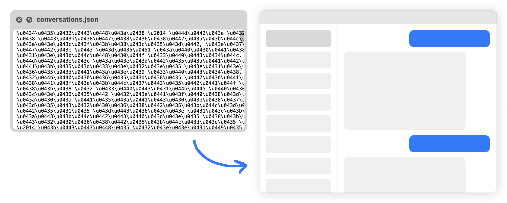

# ChatGPT Export Viewer



A web application for viewing ChatGPT chat history exported from ChatGPT. Provides a convenient interface for browsing and searching through your exported chat conversations.

## Features

- View list of all chats
- Search through chats
- Dark theme support

## Installation

1. Create a backup of your ChatGPT conversations (ChatGPT Settings - Data Controls - Export) and copy `conversations.json` to the root directory of this project

2. Clone the repository:
```bash
git clone https://github.com/sugrarin/chatgpt-export-viewer.git
cd chatgpt-export-viewer
```

3. Run the script (this will create a `chats` directory with your conversations):
```bash
python split_chats.py
```

4. Start the server:
```bash
python server.py
```

5. Open your browser and navigate to:
```
http://localhost:8000
```
